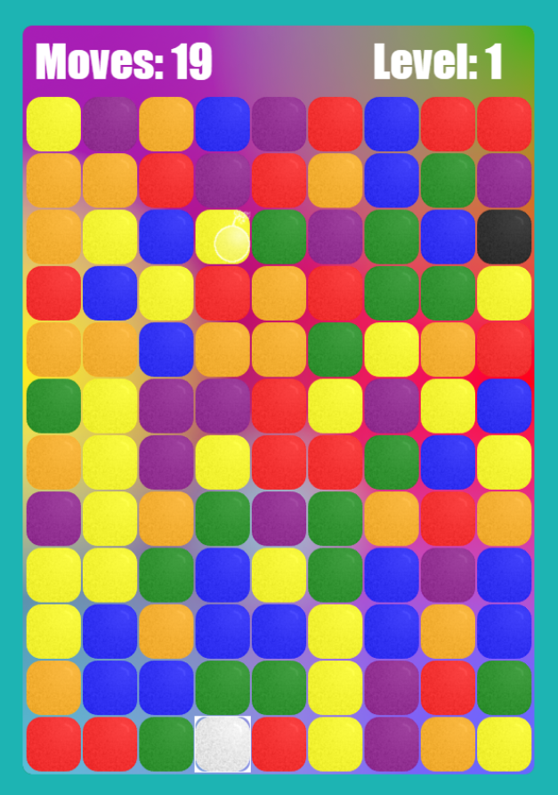

# Net Intruder
> color-matching puzzle game originally for LD#27, now as it's own game to be expanded upon.

## Table of contents
* [General info](#general-info)
* [Screenshots](#screenshots)
* [Technologies](#technologies)
* [Setup](#setup)
  * [Requirements](#requirements)
  * [Usage](#usage)
* [Features](#features)
* [Status](#status)
* [Inspiration](#inspiration)
* [Contact](#contact)

## General info
I originally made this game to saitify my own curiousity about the game mechanics. After a few years, I came back to it to see if I could take it to the next level. 

[Project documentation on coda.io](https://coda.io/d/Master-Project-List-FBD_ddKUgkxSKaN/Net-Intruder_suPIl#_lu01L)

[Demo site](http://fusionbombsderp.com/net_intruder/)

## Screenshots

## Technologies
* Phaser 3 - version 3.17.0
* Phonegap - version 7.1.0

## Setup
It's a client side javascript framework, should run out of any web server from `/var/www/net_intruder/` without any further installation.

### Requirements
Phaser 3, linked through CDN.

### Usage
Load via browser and play per instructions!

## Features
* Base game mechanics fully playable on all browsers
* Exports to Android apk
* Basic level and new square types added

To-do list:
* Add all outlined square types
* Finish level algorithm to accomdate them all
* Acquire Apple Developer license and export app to iOS. 

## Status
Project is: _in progress_, awaiting completion of higher priority tasks.

## Contributing
Looking to collaborate on art, and can always use more play testers. Head over to the github [issue tracker](https://github.com/vulpineblaze/net_intruder_ld27/issues/new) to report anything amiss. 

## Inspiration
I spent years believing this game existed, and that I had played it as a child. I couldn't find it in my adult life and dediced then to create it. 

## Contact
Created by [@vulpineblaze](https://github.com/vulpineblaze) - feel free to contact me!
